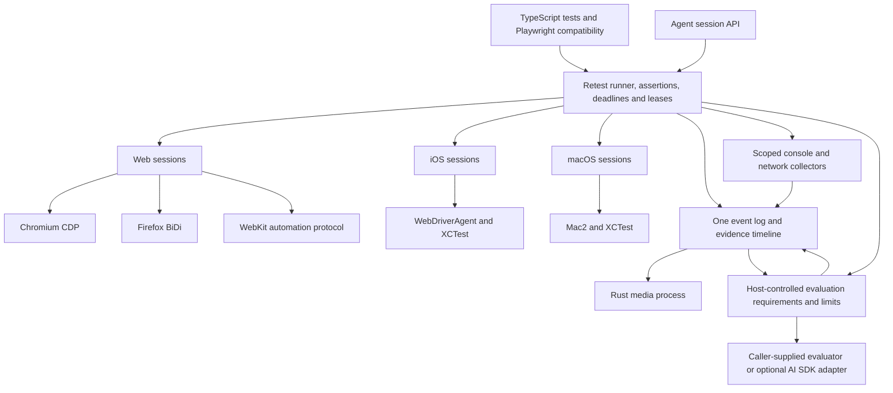

# Retest public beta plan

Updated 3 October 2026. This records the founder's requested scope and proposes the work needed to release it. The implementation and acceptance checks below are planned unless marked as current.

Use [Retest scope for the first two releases](releases.md) for the release boundary, and the [Retest 0.1.0 scope and implementation handoff](release-0.1.0.md) for its five implementation phases and release gates. This document supplies the combined architecture reference. Its broader future features do not enlarge 0.1.0.

The first public beta should let someone install Retest, run an ordinary browser test, and write one test that creates an object in an iOS app, changes it on the web, and checks it in a native macOS app. Rehearsal should use the same released engine for its advertised capabilities.

The requested scope changes the order in the existing [roadmap](../../roadmap.md). Firefox, WebKit, iOS, macOS, AI evaluation and console/network output are in the first release. Electron apps joined the first release as a desktop target of the Chromium driver; Android, Windows and the parts of Electron the renderer does not reach can follow. The existing roadmap and speed handoff have local changes, so this plan leaves them intact. The [AI evaluation contract](ai-evaluation.md), [console/network contract](diagnostics.md) and [reproduction/replay contract](replay.md) define the additional 0.1.0 architecture and acceptance checks. Replay adds declared host state preparation, executed-bundle/configuration/requirement identity and attempt-bound failure evidence. Autonomous product agents, source mutation and learned app simulation remain separate work.

## 1. The product to release

| Requirement | Beta contract |
| --- | --- |
| Web | Chrome or Chromium, Firefox and WebKit run the common browser contract. Each run names the actual engine and version. |
| Mobile | A native iOS app runs on an iOS simulator. A physical iPhone is a separate support claim with its own signing, device and recovery checks. |
| Desktop | A native macOS app runs in an interactive Mac session. An Electron browser window alone does not satisfy this requirement. |
| One flow | One test can hold iOS, web and macOS sessions, share ordinary test data between them, and produce one result with evidence from every app. |
| TypeScript | Published JavaScript and declarations, useful inference, ordinary test helpers and practical TypeScript execution. Unsupported compiler versions or module formats are documented and diagnosed. |
| Local use | No Rehearsal account or cloud credentials are required. Platform prerequisites are checked before the test starts. |
| Web participants | Predeclared named web participants have isolated authentication and observation/evidence identity; configured owner/host reservations bound simultaneous sessions. |
| Replay | A standalone host can prepare declared state, reproduce the intended failure in a distinct session and rerun the unchanged test after an app repair, preserving check identity and evidence. |
| Adoption | A measured subset of existing Playwright suites runs without rewriting assertions, locators or fixture logic. The supported subset has a generated compatibility table. |
| Rehearsal | A pinned release works through discovery, codification, independent verification and execution for each capability Rehearsal advertises. |

Simulator support is the recommended first iOS release boundary. It is native app testing, and it should be described as simulator support everywhere. A public promise about physical iPhones requires the physical-device gate in section 9.

This is a public beta, not a claim of complete Playwright equivalence. The invitation becomes credible when the documented workflows work on another person's machine and a failure gives them enough information to fix their test.

## 2. What to take from Bun

Bun made adoption easier by retaining familiar JavaScript conventions and compatibility with existing packages. It also combined tools people otherwise assembled themselves. Its current compatibility process runs thousands of upstream Node tests before releases. Retest should use existing Playwright tests in the same way. [Bun 1.0](https://bun.sh/blog/bun-v1.0), [Node compatibility](https://bun.sh/docs/runtime/nodejs-compat).

Bun uses Apple's JavaScriptCore engine. Owning a runtime does not require rebuilding the execution engine beneath it. Retest can own scheduling, assertions, types, reports and session semantics while using existing browsers and Apple automation components. [Bun runtime](https://bun.sh/docs/runtime).

The practical lessons for Retest are:

- Make trying it cheap. Install, choose a target, run an existing test, inspect a useful result.
- Check behavior against the incumbent. Matching method names is insufficient.
- Offer a capability people currently assemble from several tools. Here that is an iOS, web and macOS flow with one lifecycle and one report.
- Measure speed with comparable work, including evidence and cleanup.

Rust can contribute to this product. A Rust implementation alone does not establish compatibility, better diagnostics or a faster complete run.

## 3. What exists today

Retest already owns its TypeScript runner, assertion implementation, versioned events, parent-controlled browser commands and Chromium CDP client. It has named web apps, fresh browser contexts, browser pooling, file workers, typed registrations, secret references, sign-in state, actionability checks, failure screenshots and terminal reports. Its Playwright import adapter implements a small explicit subset.

The current driver contract is [OwnedBrowser and OwnedPage](../../../src/browser/contract.ts). It assumes browser contexts, URLs, navigation and web storage. [Target configuration](../../../src/config/types.ts) currently accepts Chromium-family targets. This boundary needs to grow before native apps can share the runner.

The current package is private at version 0.0.0. It requires Node 24.12 or later. Its test loader initially accepts erasable TypeScript; enums, parameter properties, JSX and TypeScript path aliases do not work through that path. The existing [guide](../../guide.md) documents the supported API and limits.

In the assessment preceding this plan, TypeScript 6 and 7 typechecks passed, 1,639 unit tests passed, and 97 selected integration tests passed against real Chrome. Those checks support the existing Chromium implementation. They do not establish Firefox, WebKit, native apps, full integration coverage or release readiness. The logs are `/tmp/retest-assessment-typecheck.log`, `/tmp/retest-assessment-unit.log` and `/tmp/retest-assessment-integration.log` on the assessment machine.

The repository has recorded favorable cold-run benchmarks, but larger suites are roughly level with Playwright in the saved measurements. Those benchmarks have not been independently reproduced during this assessment. Use the [speed plan](../speed/plan.md) and [handoff](../speed/handoff.md) as experiments to reproduce, not as public performance guarantees.

Rehearsal has an optional Retest execution adapter. It still defaults to Playwright, its discovery runtime uses Playwright, and its vendor archive predates the current Retest source. Integration work remains even after the library's next features land.

## 4. Define the everyday browser baseline

There is no evidence here for a literal "99% of Playwright usage." API counts do not tell us how many teams can migrate. A suite with hundreds of simple actions may still require one unsupported fixture or upload operation before any test can start.

The following is the recommended baseline for ordinary application tests. It is a prioritization proposal, not a measured usage distribution.

| Area | Required browser behavior | Current Retest gap |
| --- | --- | --- |
| Test lifecycle | `test`, suites, steps, before/after hooks, skip/only/fixme, timeouts, test metadata, cleanup on failure | Some hooks exist; suite-level hooks, controls and metadata need work. |
| Fixtures and configuration | Page/context/browser fixtures, `test.extend`, test and worker scope, `test.use`, projects, base URL, app server startup, storage state | Named apps and sign-in state exist. Fixture lifecycles and Playwright config semantics are incomplete. |
| Locators | Role/name, label, text, test ID, placeholder, CSS; chaining, filtering, first/last/nth; strictness and regex/exact behavior | Simple locators exist. Composition and several locator kinds are missing; defaults differ from Playwright. |
| Interaction | Navigate/reload, click/double click, fill/press, keyboard, select, check/uncheck, hover, focus, scroll, upload | A useful core exists. Common companion actions and files need support. |
| Assertions | Visible/hidden, text/contain text, value, count, checked, enabled/disabled, empty, class, attribute, URL/title; negation, regex, soft checks and polling | Retrying assertions exist, but matcher and argument compatibility is narrow. |
| Authentication | Isolated cookies and storage, reusable signed-in state, multiple contexts, permissions and browser settings used by the acceptance suites | Storage state exists. Wider context options and multi-page behavior need checks. |
| Application boundaries | Popups/tabs, dialogs, iframe locators and open shadow roots | These need explicit implementation. |
| Network and data setup | Request/response waits, API request fixture, basic route mocking, deterministic test data | Browser network hooks and the request fixture are missing. |
| Files | Uploads, downloads, completion/error reporting and artifact ownership | Downloads are currently denied; files need lifecycle support. |
| Visual checks | Web screenshot comparison with explicit baselines, image thresholds and reviewable diffs if the selected suites use it | Failure screenshots exist; screenshot assertions need an implementation and platform policy. |
| Running in CI | Filtering, workers, projects, retries with attempt history, forbid-only, durable exit codes | File workers and exit codes exist; several scheduling and compatibility controls are missing. |
| Debugging | Source location, expected/actual values, screenshot, action timeline, console/network failures, HTML and JUnit reports | JSONL, failure screenshots and terminal reports exist. Human evidence and CI reporting need work. |

Playwright's [locators](https://playwright.dev/docs/locators), [assertions](https://playwright.dev/docs/test-assertions), [fixtures](https://playwright.dev/docs/test-fixtures), [configuration](https://playwright.dev/docs/test-configuration) and [network APIs](https://playwright.dev/docs/network) are the behavioral references. Their edge cases matter as much as their signatures.

Do not make trace-viewer format compatibility, Playwright UI mode, component testing, code generation or every third-party reporter prerequisites for this beta. A readable Retest timeline and evidence report are required. The full Playwright developer-tool ecosystem can follow.

### Define the native baseline separately

| Area | iOS simulator | Native macOS |
| --- | --- | --- |
| Lifecycle | Install a compatible app build, launch, activate, terminate; document app-data and keychain reset behavior | Launch, activate, terminate; identify the test-owned app and document persistent-data isolation |
| Locators | Accessibility identifier, role, label, text and scoped descendants | Accessibility identifier, role, label, text, window and scoped descendants |
| Input | Tap, fill, keyboard input, scroll and swipe; handle the software keyboard | Click, fill, keyboard shortcuts, scroll, window selection and native menus |
| State and checks | Visible/hidden, enabled, text, value, selected state and count where the platform exposes them | The same supported checks, with window/app identity in observations |
| Interruptions | Native alerts, declared permissions, app crash and loss of simulator connection | Native dialogs, focus changes, denied Accessibility permission and app crash |
| Evidence | Failure screenshot, action/check timeline, app/build/simulator identity | Failure screenshot, action/check timeline, app/build/host identity |

Every row needs a real native test, including failure cases. Common method names do not establish equivalent role or text matching across platforms. Publish those mappings with the tested limitations.

### Measure suite compatibility

Use four layers of evidence:

1. Small tests for each promised method, option and failure behavior. Run the same cases under Playwright and Retest.
2. The official Playwright starter test and a fixed selection of the upstream browser tests. Preserve all assertions and record upstream revisions.
3. Preselected workflows from real products. Start with [Immich's web/UI test projects](https://github.com/immich-app/immich/blob/main/e2e/playwright.config.ts) and [AFFiNE's local application suite](https://github.com/toeverything/AFFiNE/blob/canary/tests/affine-local/playwright.config.ts), plus Rehearsal's generated customer-flow examples. These are proposed inputs; they were inspected as configuration examples, not executed in this assessment.
4. Pilot users bring their own suites. Record missing methods, unsupported configuration and semantic differences before expanding the claim.

Pin commits, list the chosen tests before implementation, and keep unavailable tests in the denominator. Fix application setup separately from Retest failures. A supported unchanged test retains its fixture dependencies, actions and assertions. A rewritten port does not count as unchanged compatibility.

Publish both collected/executable counts and matching outcome counts. Compare passing cases, intentional failing cases, skipped cases, retry histories and cleanup. A green test count alone can hide a weakened assertion or a skipped browser. Any percentage describes this named corpus only.

## 5. One runner with platform capabilities

Retest should own the test lifecycle, deadlines, scheduling, result semantics and evidence model. Drivers should translate bounded commands into real platform operations and return observations.



The diagram describes responsibilities, not APIs that already exist. Evaluation receives read-only sanitized evidence; the parent keeps verdict authority and prior failures. The optional adapter does not impose model credentials or SDK dependencies on ordinary tests. Browser diagnostics use driver subscriptions; native diagnostics name the declared source or its absence. Avoid inventing a generic remote desktop framework before the first native flow works. Start with the actual operations Chrome, iOS and macOS need, then extract their shared contract.

| Shared contract | Web-specific capabilities | Native capabilities |
| --- | --- | --- |
| Acquire/release, readiness, bounded commands, stable locator recipes, observations, assertions, input outcome, cancellation, screenshot, evidence identity | URL/navigation, contexts and storage, tabs, frames, network, DOM, browser permissions | Install/launch/activate/terminate, accessibility identity, app state/reset, gestures, windows/menus, native permissions |

An iOS app should not have fake `goto`, cookies or DOM methods. A web page should not pretend to offer native app installation. Types expose capabilities for the configured target. A target that offers several backends exposes only operations guaranteed by all of those backends, unless the test explicitly narrows the target.

Keep familiar locator names when the semantics hold. `getByTestId` maps to `data-testid` on the web and accessibility identifiers in Apple apps. Role, label and text matching need published platform mappings. Some applications do not expose a usable accessibility tree; a missing identifier must produce a locator failure, not silently turn into an AI-selected coordinate.

Preserve these existing Retest rules across every driver:

- Assertions can look again. An action is not blindly replayed after an uncertain response.
- Cancellation stops unsent work. It cannot undo input already sent to an app.
- A crash after dispatch can leave an unknown outcome. Record that state and the last evidence.
- Observations belong to a session and document or app generation. Stale references are rejected.
- The parent recomputes supported locator assertions from observations. That does not prove arbitrary user-code assertions or the user's intended business outcome.
- Each test gets the documented isolation level. Native app relaunch is not equivalent to clearing app data or keychain state.

### Acquire resources before acting

The scheduler must acquire all apps a cross-platform test needs before the first application action. It should not click in iOS and then discover that the Mac is unavailable.

Use a consistent acquisition order, bounded reservations, leases and expiry. Native devices and the interactive Mac desktop are scarce resources. Serialize commands within a session and native tests that share one desktop. Permit browser concurrency where isolation is proven. Losing a lease ends the affected attempt; it must not return an apparently successful test.

The first implementation can run all apps on one Mac. Remote operation later uses the same commands against a Mac agent and browser hosts. Stable command IDs, observations and evidence IDs make disconnect recovery inspectable. IDs alone do not guarantee exactly-once native input.

## 6. Reuse the parts that are expensive to recreate

| Target | Recommended first backend | Work Retest still owns |
| --- | --- | --- |
| Chrome/Chromium | Existing CDP implementation | Finish locator, context, network, file and lifecycle behavior. |
| Firefox | Stock Firefox through WebDriver BiDi | Prove isolation and input, implement the common contract, and test browser-specific differences. |
| WebKit | A pinned automation-enabled WebKit build with a matching protocol client | Prove launch, contexts, observations, input and screenshots on the claimed hosts before choosing the integration. |
| Native iOS | WebDriverAgent through XCTest, with Appium XCUITest available to bootstrap installation and session management | Locator semantics, deadlines, honest outcomes, leases, evidence and reset policy. |
| Native macOS | Appium Mac2/XCTest as the first proven executor | Window/menu behavior, accessibility mappings, desktop lease, isolation and evidence. |

Firefox's supported Remote Agent protocol is BiDi; its old CDP path is not the basis for a new driver. [Firefox protocol preferences](https://firefox-source-docs.mozilla.org/remote/Prefs.html).

WebKit is the highest-risk browser choice. Playwright uses a WebKit build with automation patches and does not drive branded Safari. Its WebKit backend has its own context and page protocol. Safari through `safaridriver` therefore does not meet the requirement to offer the Playwright-style WebKit target. [Playwright browsers](https://playwright.dev/docs/browsers), [WebKit backend source](https://github.com/microsoft/playwright/blob/main/packages/playwright-core/src/server/webkit/wkBrowser.ts).

The WebKit proof should compare a small direct client for that pinned protocol with a Linux WebKitGTK/WPE WebDriver route. The latter would be a separately identified WebKit distribution and must pass the same promised contract. Do not assume either route gives full macOS and Linux parity.

For a fast WebKit proof, using Playwright's browser library as an explicit experimental adapter is reasonable. It is not a completed independent WebKit driver. Before making it required for a release, reconcile that choice with Retest's current architecture and dependency rule. This plan adds no dependency. The preferred release route keeps the runner and assertion implementation independent, reuses upstream builds, and implements or adapts only the necessary driver code with attribution.

[WebDriverAgent](https://github.com/appium/WebDriverAgent) already supplies native iOS control through XCTest and supports simulators and devices. [Mac2](https://github.com/appium/appium-mac2-driver) already targets native macOS applications through XCTest. Reusing these executors removes a large amount of initial platform work. It does not remove Xcode setup, signing, permissions or device ownership.

Keep platform executors behind the session contract. Appium can be a declared platform prerequisite or an optional adapter without becoming Retest's test runner. If the release depends on it, the README must say so. The current claim that there is no automation framework underneath would need updating for those targets.

Record upstream revisions, binary checksums, licenses and attribution. Pin browser builds and driver versions as a tested set. Replace a backend later only after the replacement passes the same tests and produces equivalent outcomes. Existing application tests should survive that replacement.

## 7. TypeScript compatibility is two separate jobs

Retest already has useful type inference. It needs a broader execution contract as well. A typecheck can pass while the runtime fails to load an imported helper.

| Contract | Beta acceptance |
| --- | --- |
| Published package | Install the packed package outside this checkout; imports resolve to shipped JavaScript and declarations. |
| Editor types | App, target, fixture, tag, secret and test-ID inference; invalid capabilities produce useful compiler errors. |
| Compiler versions | Keep TypeScript 6 and 7 checks. Try older widely used versions, starting with 5.8 and 5.9, and publish only the versions that pass. Avoid raising the minimum solely for an implementation convenience. |
| Test execution | `.ts` and JavaScript tests, imported helpers, extensionless relative imports, config loading and source maps. |
| Project resolution | Test `tsconfig` paths, `baseUrl`, `extends` and monorepo project references used by the chosen suites. Define the supported resolution rules. |
| Language transformation | Support enums and parameter properties through a tested transformer; handle JSX/TSX helpers if the chosen suites require them. Diagnose unsupported features. |
| Module formats | Test ESM and CommonJS suite loading, including dependencies and config files. Publish a precise matrix rather than a blanket interoperability claim. |
| Check versus run | Test execution transforms code; a separate command or normal `tsc` checks types. Neither step should secretly claim to perform the other. |

Playwright loads TypeScript tests and supports selected `tsconfig` settings, including path mapping. Node's native type stripping is narrower. A replacement that fails on everyday helper imports imposes a migration cost even when its browser API matches. [Playwright TypeScript support](https://playwright.dev/docs/test-typescript), [Node TypeScript support](https://nodejs.org/api/typescript.html).

Start by evaluating an existing compiler or transformer. An optional installed TypeScript compiler can handle a documented compile-first path; a bundled or optional transformer can offer direct execution. Measure cold startup and caching before choosing. Keeping zero runtime npm dependencies remains possible, but it is a product constraint with a cost. Do not write a TypeScript compiler to preserve that number.

Run positive and negative type fixtures against the published declarations. Run runtime fixtures separately for resolution, configuration and emitted syntax. Include consumer projects outside the repository so development-only import conditions cannot hide missing package files.

### Keep compatibility semantics visible

The Playwright adapter must preserve Playwright locator defaults, negation, matcher behavior, fixture scope and timeouts. It should not change native Retest semantics just to share an implementation detail.

Existing differences need named decisions. Retest currently fails a test with no assertions; Playwright does not require an assertion. Retest also guards real input more strictly than Playwright escape hatches such as `force` or `evaluate`. Decide and document the adapter's behavior, then compare it in tests. Until equivalent behavior exists, count the affected test as incompatible. Never drop an assertion or silently report a stricter failed test as compatible.

## 8. Give Rust a bounded media job

The Rust media process is required in Release 1 so Rehearsal uses Retest with screenshots and recording from the start. Its responsibilities are frame buffering, timestamps, compression orchestration, image resizing, thumbnails, video assembly and artifact finalization. Browser and OS capture APIs remain the frame sources. Existing native codecs such as FFmpeg or platform encoders should do the encoding.

Playwright's video recorder already launches FFmpeg. Moving JavaScript glue to Rust does not automatically improve the expensive codec work. [Playwright video recorder](https://github.com/microsoft/playwright/blob/main/packages/playwright-core/src/server/videoRecorder.ts).

The implementation should have:

- A versioned input protocol with run, test, app, session, action and frame IDs.
- Monotonic timestamps and a timeline that handles different capture rates and remote hosts.
- Bounded queues, backpressure and explicit frame-drop counts.
- Capture sources proven separately for Chromium, Firefox, WebKit, iOS and macOS. A screenshot loop is not advertised as a native live frame stream.
- Image redaction or a documented capture policy before frames are persisted or streamed. Text redaction does not redact pixels.
- Bounded finalization, encoder exit status, artifact integrity and cleanup after cancellation.
- A separate evidence status when recording fails. A release gate can require complete evidence without replacing the observed application verdict.

Rust should be one boundary, not a requirement to rewrite the runner, assertions and all platform drivers. A separate process initially avoids a Node ABI coupling and contains media crashes. Compare its startup and copy overhead against the existing pipeline before choosing a native addon instead.

Retest currently asks Chrome to close and immediately ends its process group because there is nothing to save. Video and trace artifacts change that assumption. Flush evidence before killing the process, under a finite deadline, and include that cost in benchmarks.

### Measure the complete run

Instrument collection, transformation, app startup, target acquisition, browser/device launch, context/reset, locator resolution, actionability, protocol round trips, application wait, assertion polling, capture, encoding, finalization and cleanup. Record queue wait separately from execution time.

Compare warm and cold runs, one test and many tests, one file and many files, media off and on, pass and failure. Pin Retest and Playwright versions, use the same browser build where possible, and match assertions, isolation, workers and evidence settings. Report median and p95 latency, CPU, peak memory and artifact size. Keep the tests and raw results available.

The likely first gains are fewer protocol round trips, better observation scheduling, appropriate browser pooling, reuse between runs and less host orchestration overhead. That is a hypothesis to measure. Saved Retest measurements showing mostly idle parent CPU make a wholesale Rust rewrite a weak first optimization.

For example, if a media phase consumes 20% of non-overlapping run time, halving its time cuts the complete run by 10%. Media work that already overlaps application waiting may improve CPU use without reducing elapsed time. Measure both.

## 9. Build order and acceptance gates

Each phase ends with a running example or a checkable artifact. Dates should follow the initial proofs and the people assigned to the work. AI code generation does not remove device setup, compatibility discovery or reliability testing.

### Phase 0. Prove the platform choices

Timebox the initial investigation to five working days. This is an investigation budget, not a promise to finish five drivers.

- Pin the compatibility corpus and create a feature inventory including helpers and fixtures.
- Define the shared session/outcome contract without removing existing browser behavior.
- Prove Firefox launch, isolated session, locator, input, assertion and screenshot.
- Prove the same WebKit sequence on macOS and Linux, or record exactly which host or operation fails.
- Drive one native iOS simulator screen and one native macOS window using existing executors.
- Try representative TypeScript alias, enum, ESM and CommonJS projects through candidate loaders.
- Prove a minimal frame-to-recording path through a Rust process, including clean shutdown and encoder failure.
- Measure one Rehearsal run by phase so library time and host time are distinguishable.

Exit with executable prototypes, prerequisites, observed gaps and a backend decision record. Give the remaining work an estimate from those results. If WebKit or a native executor fails, repair or choose the backend before expanding the public promise.

### Phase 1. Run the differentiating flow

- Implement iOS and macOS sessions behind the agreed boundary.
- Add leases, native state/reset rules, permission checks and command cancellation.
- Build a small native iOS app, web app and native macOS app backed by one local service.
- Create in iOS, edit on the web, verify on macOS. Include real login, asynchronous sync and a deliberately broken sync case.
- Implement the Rust media process with the capture adapters, synchronized timestamps and bounded finalization.
- Produce one report with target identity, action/check distinctions, screenshots and recorded evidence for every app.

Exit when the same flow passes and fails for the right reasons on a clean Mac installation. Run it early, before finishing every Playwright edge case. It will expose incorrect abstractions while changing them is cheap.

### Phase 2. Make the Chromium product usable

- Implement the baseline lifecycle, fixtures, configuration, locator composition and assertions.
- Add files, tabs, dialogs, frames, network waits and basic mocks.
- Finish the TypeScript loader and published type matrix.
- Add HTML/JUnit output, retry history, filtering, CI controls and explicit shared-state locks.
- Generate a compatibility table from differential tests.

Exit when the starter and the declared Chromium workflow corpus run with documented equivalent behavior from a clean package installation. Include intentional failures and teardown checks. This can support a clearly scoped browser alpha while the other targets mature.

### Phase 3. Complete the browser matrix

- Implement the chosen Firefox and WebKit backends to the promised baseline.
- Run the common browser tests on Chrome, Firefox and WebKit, plus backend-specific failure tests.
- Repeat the cross-platform flow with each web engine, including screenshot and video artifacts through the Rust pipeline.
- Add explicit browser installation with pinned versions and checksums, cache inspection and useful `doctor` diagnostics.

Required host gates are macOS arm64 for all five targets and Linux x64 for the advertised web engines. Retain existing Linux Chromium checks. Add other architecture claims only when exercised. A missing engine fails target setup; it never silently falls back to Chrome.

Exit with a generated engine/host/operation matrix and no unsupported operation among the promised workflows.

### Phase 4. Finish evidence and Rehearsal integration

- Integrate the Release 1 Rust pipeline with Rehearsal's live frames, saved evidence and artifact uploads.
- Verify synchronized evidence, retention settings and bounded finalization through the host lifecycle.
- Finish Retest's observe/act session API so an agent can explore using the same sessions that tests exercise.
- Replace Rehearsal's stale local archive with a pinned tested package artifact.
- Exercise discovery, codification, independent verification and execution through the runner boundary.
- Keep browser ownership on the runner and credentials on the authorized host. Generated test processes receive the intended allowlist.

Rehearsal's current Linux browser runner cannot also be a native iOS/macOS host. Add a Mac executor with target leases and health reporting. Native macOS needs an interactive session. A single Mac is enough for the initial demonstration and pilot, with serial native desktop work; it is not a capacity plan for arbitrary concurrent customers.

Before Rehearsal advertises native testing, model native app builds and target configuration as authorized project resources, provide artifact ingestion and platform setup, and expose the results in the product. Its current website model and browser tools do not provide this automatically. Preserve workspace access, private discovery rules, secret handling and durable run recovery. Existing Rehearsal web flows must still pass and fail for the same reasons.

Exit when a new Rehearsal user can create and run each advertised kind of test using the promoted candidate. Retest's local SDK beta and Rehearsal's native product rollout can have different dates, but their public claims must match their verified state.

### Phase 5. Invite people after a pilot

- Install the packed release candidate on a clean Mac and clean Linux web host.
- Run the quick start, an unchanged supported Playwright example and the iOS/web/macOS flow without access to this checkout.
- Ask at least five pilot engineers to follow the written instructions without live assistance. Record failures and fix the recurring ones. This is a proposed release check, not authorization to contact anyone.
- Run 100 repeated cross-platform fixture flows on the tested matrix. Classify app, infrastructure and test failures; investigate every false pass and unclassified failure. This is a stability check, not proof of a population reliability percentage.
- Inject browser/agent crashes, lost connections, cancellation, denied permissions, expired leases and capture failures. Inspect the result and leftover processes.
- Review package contents, platform prerequisites, support matrix, licenses, examples and upgrade instructions.
- Run the existing [release gates](../../releasing.md) plus the new platform and consumer gates on one chosen commit.

Only then choose a version and perform the separate release promotion. Planning and preparing a candidate do not publish the package or change `private: true`.

### Physical iPhone gate

Before claiming physical-device support, test a signed build and WebDriverAgent on a trusted device, cold setup, disconnection, reconnection, lock state, permissions, app reset limitations and evidence capture. Record the supported Xcode/iOS/driver combination. Device prerequisites and signing are a distinct path from simulator setup. [XCUITest requirements](https://appium.github.io/appium-xcuitest-driver/latest/getting-started/system-requirements/).

## 10. Proposed example and release claims

This is proposed syntax aligned with the existing typed named-app design. It is not executable against current Retest. Fixture cleanup, target declarations and app setup are omitted from this short example.

```ts
test('a task syncs across the phone, web and Mac',
  { apps: ['iphone', 'web', 'mac'] },
  async ({ iphone, web, mac }) => {
    const title = `Task ${test.info().attemptId}`

    await test.step('Create the task on iOS', async () => {
      await iphone.getByLabel('Title').fill(title)
      await iphone.getByRole('button', { name: 'Save' }).tap()
      await expect(iphone.getByText(title)).toBeVisible()
    })

    await test.step('Complete it on the web', async () => {
      await web.goto('/tasks')
      await web.getByRole('link', { name: title }).click()
      await web.getByRole('checkbox', { name: 'Completed' }).check()
      await expect(web.getByText('Completed')).toBeVisible()
    })

    await test.step('Check the change on macOS', async () => {
      await mac.getByText(title).click()
      await expect(mac.getByTestId('task-status')).toHaveText('Completed')
    })
  })
```

Before release, the example becomes a real fixture with assertions against unique task identity and state. Publish instructions that build the native apps, start their shared service, install the tested prerequisites and run the test.

The defensible beta promise is: "Run tests in Chrome, Firefox and WebKit. Write one TypeScript flow across an iOS simulator app, the web and a native macOS app. Inspect one result with evidence from every app."

Add a Playwright compatibility percentage or speed comparison only when the published corpus and benchmark establish it. Keep platform limits next to setup instructions. The release should lead with the workflow it can demonstrate.

## 11. The next implementation session

Start with Phase 0. Its most consequential outputs are the WebKit route, one real native flow prototype and the TypeScript loading decision. Keep these proofs small and runnable. Then update the architecture and roadmap around the selected backends before broad driver work begins.

Preserve the current runner and assertions while introducing the session boundary. Build the native flow early, complete the browser baseline, and promote only a candidate that passes the five-target contract and the consumer installation checks.
